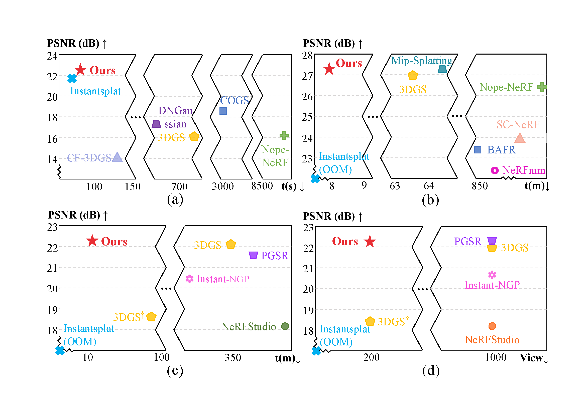

# ScaleSplat📏

Scalable SfM-free 3D Gaussian Splatting via Memory-Representation Co-Design. 

## 🎯 Project Highlights

- We propose **ScaleSplat**, a scalable SfM-free 3D Gaussian Splatting framework that unifies **sparse-view**, **dense-view**, and **large-scale scene** reconstruction within **a single model**, significantly lowering the data and computational barriers of existing 3DGS methods under practical GPU memory constraints.
- We introduce a **memory-representation co-design** that reduces peak GPU memory by about **75%** during geometry inference and eliminates **25-80%** of redundant Gaussians during optimization, enabling scalable SfM-free reconstruction on consumer-grade GPUs.
- We develop a **geometry-preserving strategy**, including confidence-aware depth regularization and dual-constraint multi-view geometric consistency, to effectively maintain structural fidelity and rendering quality after aggressive Gaussian pruning.

## 📊 Results Comparison

The following figure summarizes the key performance comparisons of ScaleSplat:

*Figure 1: Relationships among reconstruction quality, end-to-end time, and required input views.*
- **(a-c)** report PSNRs versus end-to-end time under sparse-view, dense-view, and long-sequence large-scale settings, respectively.
- **(d)** reports PSNR versus the number of required input views for long-sequence large-scale scenes.
- Methods that run out of GPU memory are marked as **OOM**.

## 🚧 Code is coming soon!
We are cleaning up the implementation and will release the full training and inference pipeline shortly.
Stay tuned and watch this repository for updates.
